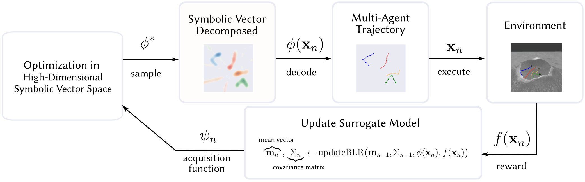

<div align="center">

# SSP-BO: Efficient Active Exploration with Compositional Neurosymbolic Representations

[](https://www.python.org/)
[](LICENSE)
[]()

</div>

---

## About

**SSP-BO** is a sample-, memory-, and time-efficient Bayesian optimization (BO) library built on compositional neurosymbolic representations — Spatial Semantic Pointers (SSPs). It replaces the Gaussian process surrogate of standard BO with a **Bayesian linear regression (BLR)** model over fixed-dimensional vector-symbolic embeddings.

Standard BO requires *O(n³)* time and *O(n²)* memory as the number of observations *n* grows. SSP-BO reduces this to *O(d³)* and *O(d²)* in the fixed embedding dimension *d* — giving **constant** time and memory per sample-selection step, independent of how many samples have been collected. On standard benchmarks, this yields up to **60–200× faster** sample selection with no loss in accuracy.

<div align="center">

<br><em>SSP-BO conducts optimization in the space of vector-symbolic representations. An embedded candidate is decoded to an action, executed in the environment, and the reward is incorporated into a BLR posterior. The next candidate is found by optimizing the acquisition function in embedding space.</em>
</div>

---

## Features

- **Constant-time sample selection** — surrogate update and acquisition optimization costs are independent of *n*; up to 60–200× faster than GP-based BO.
- **Constant memory** — BLR parameter size is fixed at *O(d²)*, not *O(n²)*.
- **Structured and mixed spaces** — SSPs encode continuous, discrete, graph, trajectory, and mixed domains via a single algebraic framework, with no domain-specific modifications.
- **Neuromorphic compatibility** — acquisition optimization runs as continuous dynamics in embedding space, enabling deployment on Intel Loihi 2 and SpiNNaker with 30–188× energy reduction per sample.
- **Drop-in interface** — `BayesianOptimization` follows the [bayesian-optimization](https://github.com/bayesian-optimization/BayesianOptimization) API.

---

## How It Works

At each step the agent:
1. **Encodes** candidate locations as fixed-size SSP vectors `φ(x) ∈ ℝᵈ`.
2. **Updates** a BLR posterior over the embedded space via a rank-one update — *O(d²)*, no matrix inversion needed.
3. **Optimizes** the UCB acquisition function directly in embedding space via gradient ascent or neural dynamics:
   `θ* = argmax [ mᵀθ + λ √(β⁻¹ + θᵀΣθ) ]`
4. **Decodes** `θ*` back to an action: `x* = argmax φ(x)·θ*`

Because the BLR parameters `(m, Σ)` have fixed size *d* regardless of how many samples have been collected, steps 1–4 have cost that is entirely independent of *n* — the key to SSP-BO's scalability.

---

## Installation

Install with [uv](https://github.com/astral-sh/uv) (recommended) or pip:

```bash
uv pip install -e .
# or
pip install -e .
```

**Optional extras** install additional packages required to run specific experiment suites:

| Extra | Purpose |
|---|---|
| `basic` | matplotlib, pandas, torch, GPyTorch, BoTorch, Optuna — needed for GP/RFF baselines and plotting |
| `nengo` | Nengo SNN stack (Nengo ≥ 4, nengo-spa, nengo-ocl) — needed for neuromorphic experiments |
| `spinnaker` | SpiNNaker backend (requires Nengo < 3; **incompatible** with `nengo`) |
| `mcbo` | Mixed-variable / combinatorial tasks via MCBO |
| `nas` | NAS-Bench neural architecture search tasks |
| `dev` | pytest, mypy, jupyterlab |

```bash
uv pip install -e ".[basic]"      # standard continuous BO + baselines
uv pip install -e ".[nengo]"      # add Nengo SNN support
uv pip install -e ".[dev]"        # development tools
```

---

## Usage

```python
import numpy as np
import ssp_bayes_opt

def objective(x, y):
    return -(x**2 + y**2)

optimizer = ssp_bayes_opt.BayesianOptimization(
    f=objective,
    bounds=np.array([[-2, 2], [-2, 2]]),
    verbose=True,
    sampling_seed=0,
)

optimizer.maximize(
    init_points=5,
    n_iter=20,
    agent_type='ssp-hex',
    ssp_dim=151,
    length_scale=0.5,
    beta_ucb=10.0,
)

print(optimizer.max)
```

See [experiments/run_agent.py](experiments/run_agent.py) for a full example with multiple agent types and result saving, and [experiments/plot_1d_blr.py](experiments/plot_1d_blr.py) for a minimal 1-D demo.

---

## Package Structure

```
ssp_bayes_opt/
├── bayesian_optimization.py        # Main BayesianOptimization class
├── nengo_bayesian_optimization.py  # Neuromorphic variant (Nengo backend)
├── blr.py                          # Bayesian linear regression surrogate
├── sspspace.py                     # SSP encoding: HexSSP, RandomSSP, etc.
├── network_solver.py               # Nengo network for acquisition optimization
├── agents/
│   ├── ssp_agent.py                # Core SSP-BO agent
│   ├── ssp_traj_agent.py           # Trajectory-space agent
│   ├── ssp_multi_agent.py          # Multi-agent variant
│   ├── ssp_nas_graph.py            # Graph-structured search (NAS-Bench)
│   ├── ssp_mcbo.py                 # Mixed-variable agent (MCBO tasks)
│   ├── gp_agent.py                 # GP baseline agent
│   └── rff_agent.py                # Random Fourier features baseline
└── util/
    └── discretized_function.py
```

---

## Citation

If you use SSP-BO in your research, please cite:

```bibtex
@article{furlong2025,
  author  = {P Michael Furlong and Nicole Dumont and Rika Antonova and Jeff Orchard and Chris Eliasmith},
  title   = {Compositional Neurosymbolic Representations Enable Efficient Active Exploration},
  journal = {Nature Communications},
  year    = {In press},
}
```
